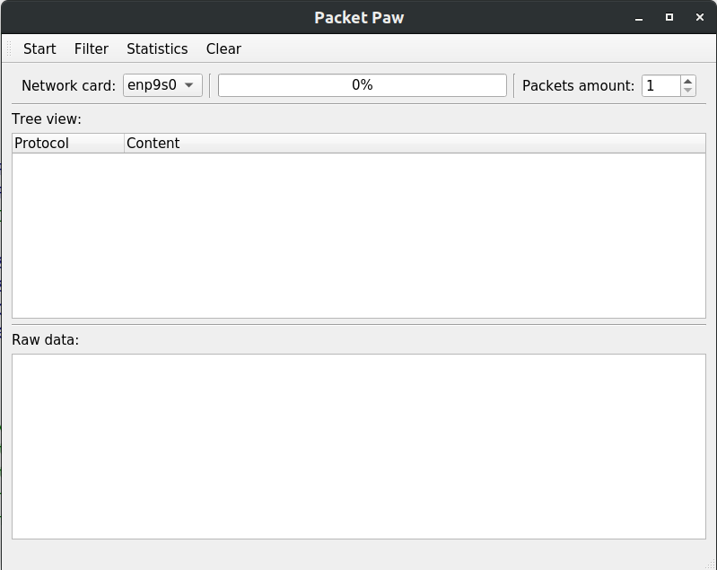
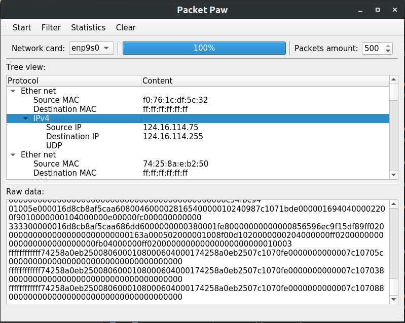
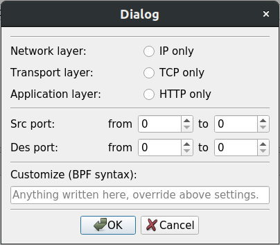
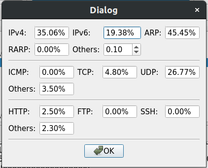
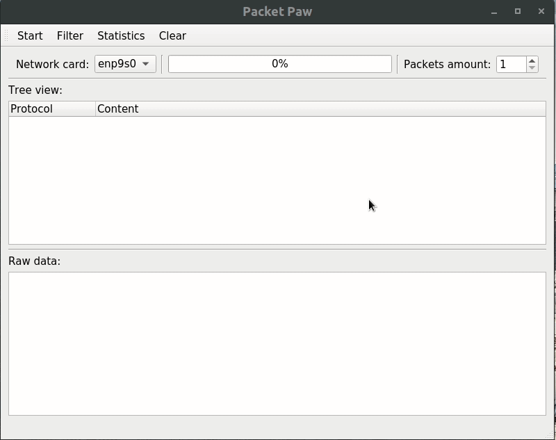

# Packet Paw

Packet Paw是一款用QT5封装[libpcap](http://www.tcpdump.org/#documentation)功能的以太网嗅探器。Packet Paw通过打开网卡的混杂模式来嗅探网络中的网络包，因此只能嗅探流经该网卡的数据包（由路由器搭建的以太网中，且路由器未处于广播模式，则该技术不适用）。注：Packet Paw采用的是0.8版本的libpcap，目前最新版本1.9的API已经和0.8不相同。

[TOC]

## 主要功能

* 嗅探网络包
  * 支持格式
    * 数据链路层：Ether net
    * 网络层：IPv4, IPv6, ARP, RARP
    * 传输层：ICMP, TCP, UDP
    * 应用层：HTTP, FTP, SSH
* 设置嗅探的过滤器：以[BPF语法](http://www.biot.com/capstats/bpf.html)为基础
* 包的类型统计

## 软件使用

主界面：

<span></span>

过滤器界面和数据统计界面：
<span></span>

演示动画：




## 代码结构

Packet Paw的代码的总体结构如下，



其中

* ```MainWindow```是主窗口的类。
* ```FilterDialog```是设置过滤器窗口的类。
* ```StatisticsDialog```是查看统计数据窗口的类。
* ```pawThread```是用于调用```libpcap```进行嗅探的线程类，因此所有的嗅探相关的代码都在这个线程当中。

上述类的实例之间通过QT的signal/slot机制通讯。

图形界面的设计主要用QT creator的ui designer完成，基本是在图形化的界面下通过拖拽各种模板组建完成的。所以可以通过QT creator打开对应的```.ui```文件高效地查看这部分内容的源代码，因此不对```MainWindow```类、```FilterDialog```类和```StatisticsDialog```类中的图形化界面的内容进行更多地说明。类之间的互联关系由已上面的结构图清晰表述，所以也不在赘述。下面对```pawThread```类做详细介绍。

### pawThread类（嗅探线程）

在我的理解下```libpcap```的嗅探原理图如下，



在我的理解下，libpcap将嗅探到的网络包放进一个队列，然后**依次调用**（经过实验发现是依次的，即上一个包的callback回调函数执行完成才会执行下一个包的回调函数）回调函数。

```pawThread```类需要完成的工作即为，调用```libpcap```的诸多接口完成虚线圆角矩形的部分。```libpcap```编程API见[manpage of PCAP](http://www.tcpdump.org/manpages/pcap.3pcap.html)或[Index of manpages](http://www.tcpdump.org/manpages/)。```pawThread```中有3个重要的函数，

* ```void init(int packet_cout)```，初始化线程内的诸多参数，比如把各个计数器清零。
* ```void run()```开始运行线程，它会完成如下工作
  * 通过```pcap_open_live```函数，打开网卡的混杂模式，
  * ```pcap_compile```编译过滤器代码，到的格式为```pbf_program```，```pcap_setfilter```应用编译好的过滤器，
  * ```pcap_loop```进入嗅探的循环当中，源代码中将回调函数设置为了```got_packet```。
* ```static void got_packet(...)```，回调函数，因此是静态函数。该回调函数将嗅探到的包的指针和长度通过signal/slot机制传递给主窗口```MainWindow```，让主窗口来处理。因此```pawThread```线程的执行速度很快，主要的解析工作全交给了主窗口所在的线程。

pawThread类的工作内容全介绍完了，接下来把视角转向```MainWindow```，看它如何处理```pawThread```发来的嗅探到的包。

### MainWindow类（主线程）处理嗅探到的包

解析包的总体思路很简单，按照协议栈从低层次到高层次依次解析，每一层次用switch语句来选择下一层次的解析函数。```MainWindow```中以协议名开头以```handler```结尾的函数即为解析包的函数。总的来说这一部分按照各个协议的定义来写即可。要注意的地方是网络包和本地机器的大小尾端问题。用```netinet/in.h```中的```ntohs```函数完成转换即可。

### FilterDialog类生成过滤器表达式

```libpcap```采用的是Berkeley Packet Filter简写BPF。```FilterDialog```类按照[BPF语法](http://www.biot.com/capstats/bpf.html)实现了很简单的逻辑。

### StatisticsDialog类显示统计数据

在```MainWindow```解析过程完成的数据统计。```StatisticsDialog```只负责显示这些统计数据。

## 后记

QT creator自带的help功能很强大。编程中时常查阅QT Reference Documentation会让编程事半功倍。

### 这个程序为什么叫Packet Paw？

这个程序的功能相比起其他的大牛软件简直就像是在挠痒痒，所以用小动物的爪paw命名我的程序。

### 编程过程遇到的问题和解决

这一部分记录编写Packet Paw过程遇到的问题

#### 调用pcap.h的函数出现“undefined reference”

在程序中调用pcap.h函数，在编译时就会出现“undefined reference”的错误。在clion里和qt creator中都会出现这个问题。上网查询只查到命令行里用gcc的解决方法，添加编译选项```-lpcap```即可。

在gcc的手册（```man gcc```）里可以查到，```-llibrary```意思为“Search the library named library when linking.”

查询到qt creator添加library的方法：

- [图形化界面](https://doc.qt.io/qtcreator/creator-project-qmake-libraries.html)，不太会用。即在qt creator里，右键点击project的文件，点‘Add library...’即可。
- [Project File](https://doc.qt.io/qt-5/qmake-project-files.html#declaring-other-libraries)，和上面gcc的编译选项类似。在```.pro```文件中添加```LIBS += -lpcap```即可解决问题。

#### 用数组来传递header和packet总会莫名其妙出错

最后把headerArray换成了lengthArray就没问题了。从debug看来，header被改变了。也就是说libpcap可能重用了之前header的内存空间。

#### ether的类型u_char值受大小尾端影响？

packetheaders.h文件中的sniff_ethernet的u_short ether_type大小尾端有问题？

将ETHER_TYPE_...的宏定义改了之后就能正常运行（目前只看到ipv4）。

大小尾端用```ntohs```函数解决，```in_addr```转字符串用```#include <arpa/inet.h>```中的```inet_ntoa```函数解决。

### 参考网站一览

* QT
  * [QT Documentation](<https://doc.qt.io/>)
  * [Getting Started with Qt](<https://doc.qt.io/qt-5/gettingstarted.html#create-your-first-applications>)
  * [Creating Project Files](<https://doc.qt.io/qt-5/qmake-project-files.html>)
  * [Developing Widget Based Applications](<https://doc.qt.io/qtcreator/creator-using-qt-designer.html>)
  * [Getting Started Programming with Qt Widgets](<https://doc.qt.io/qt-5/qtwidgets-tutorials-notepad-example.html>)
* libpcap
  * [DOCUMENTATION](<http://www.tcpdump.org/#documentation>)
  * [Programming with pcap](<http://www.tcpdump.org/pcap.html>) 很好的libpcap编程教程（适用于0.8版本的libpcap）
  * [Berkeley Packet Filter (BPF) syntax](<http://www.biot.com/capstats/bpf.html>)
* [Hex Packet Decoder](<https://hpd.gasmi.net/>) 很棒的在线解包软件，支持很多协议

